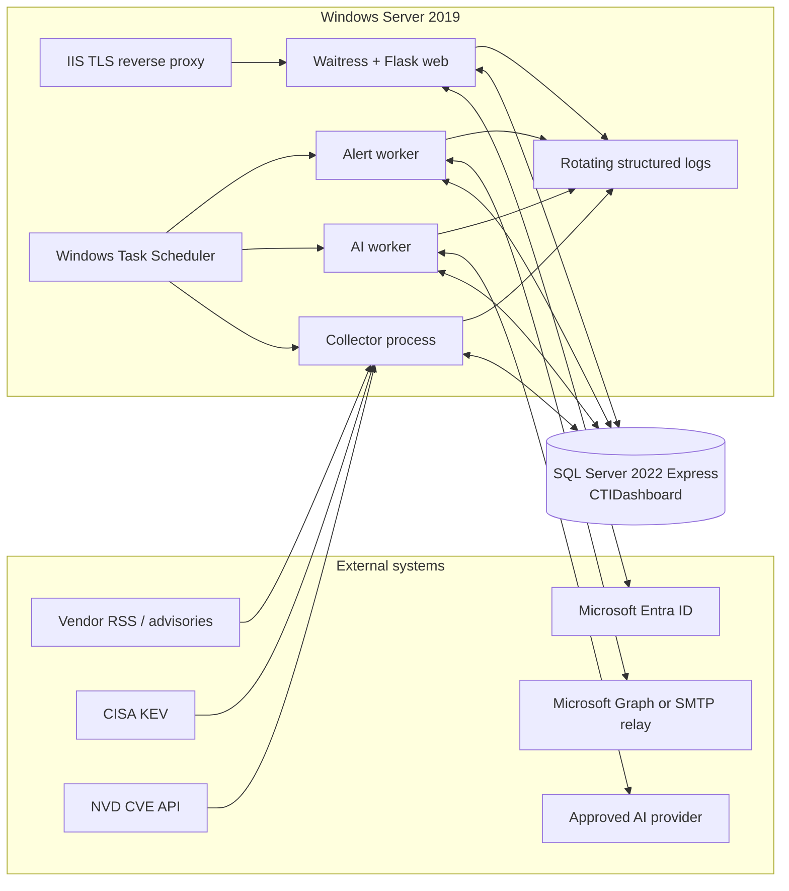
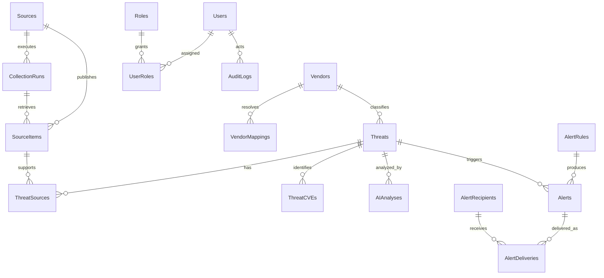

# CTI Dashboard Target Architecture and Implementation Roadmap

Status: proposed architecture for owner approval. This document is design-only; it does not implement or migrate any feature.

## A. Executive overview

The recommended target is a pragmatic **modular monolith**: one Flask codebase, one SQL Server database, and several independently started processes. The existing Vendor CRUD, Threat CRUD, and dashboard remain the foundation. New collectors, normalization, AI analysis, alerting, identity, and operations capabilities are added as modules rather than split into microservices.

The production runtime has four roles:

1. A Flask web process serves the dashboard and administrative UI through Waitress.
2. A collector command retrieves due sources and normalizes observations.
3. An AI worker processes durable analysis work after threats have been committed.
4. An alert worker evaluates rules and sends durable email deliveries.

SQL Server is the system of record and, at the expected small-team scale, also stores leases, attempts, status, and outbox work. Windows Task Scheduler starts short, non-overlapping worker runs. This avoids Redis, RabbitMQ, and Celery until measured workload requires them. AI and email are explicitly core capabilities, but neither is allowed to block collection or the dashboard.

The target supports Microsoft Entra ID single-tenant login with `Admin` and `Viewer` application roles, verifiable provenance for every collected item, race-safe duplicate detection, a real collection-health view, bilingual AI analysis, and deduplicated email alerts. Production deployment is gated on authentication, authorization, security hardening, backup/restore testing, and operational runbooks.

## B. Final architecture



The web and worker processes import the same application package, configuration system, SQLAlchemy models, repositories, and domain services. They differ only in entry point and database permissions. External-provider code is behind adapters so a feed, AI provider, or mail provider can be changed without rewriting core threat logic.

## C. Component responsibilities

| Component | Responsibility | Must not do |
|---|---|---|
| Flask web | Dashboard, CRUD, filters, source health, settings, manual retry/resend, Entra callback and role enforcement | Run long collection, AI, or email calls in requests |
| Source registry | Store source type, endpoint, schedule, enablement, cursor, and operational state | Store credentials in clear text |
| Collector adapters | Fetch one provider using bounded timeouts and return a provider-neutral envelope | Write Threat rows directly |
| Normalization service | Map vendor, CVE, severity, CVSS, KEV, dates, URLs, and text to a canonical observation | Lose the original source identity |
| Deduplication/upsert service | Resolve an observation to an existing or new threat and link provenance transactionally | Depend only on fuzzy title matching |
| Collection runner | Lease due sources, create CollectionRuns, call adapters, persist observations, and summarize outcomes | Hold a transaction open during network calls |
| AI service/worker | Build safe structured prompts, claim analysis work, validate bilingual output, store results and retry state | Block collection or execute instructions from source text |
| Alert evaluator | Match active rules to committed threat/analysis data and create logical Alerts | Send email inside the threat transaction |
| Email worker | Claim delivery records, render templates, send, record provider response, and retry safely | Create duplicate deliveries for the same event/recipient |
| Authentication/RBAC | Entra OIDC sign-in, local user shadow, `Admin`/`Viewer` authorization, session lifecycle | Store local passwords or provider access tokens in the session cookie |
| Audit service | Append security and administrative actions with actor, target, result, and correlation ID | Allow routine UI deletion or editing of audit history |
| Operations | TLS, process start, schedules, backup, restore tests, log retention, monitoring | Rely on an interactive user session |

## D. End-to-end data flow

1. The scheduler starts `collect-due-sources`. The runner atomically leases a due source and creates a `CollectionRuns` row.
2. The adapter performs an HTTP request with connect/read timeouts, conditional headers or provider cursor, bounded response size, and a descriptive user agent.
3. Each response item is first persisted as a `SourceItems` record with external ID, canonical URL, content hash, raw payload or payload reference, retrieval time, and run ID. This establishes provenance before enrichment.
4. Normalization extracts CVEs, maps source vendor names to `Vendors`, converts severity to the controlled scale, validates CVSS, records KEV evidence, normalizes dates/URLs, and creates a canonical key.
5. In a short transaction, the upsert service resolves or inserts the `Threats` record and adds `ThreatSources` and `ThreatCVEs`. Database unique constraints settle concurrent duplicate races.
6. The committed threat is immediately visible to the dashboard. Dashboard cards, charts, recent threats, filters, and collection health query SQL Server only; they never call external providers.
7. If AI is required and no matching successful analysis exists for the prompt/model/input hash, an `AIAnalyses` row is queued. The AI worker later claims it, calls the provider, validates structured Thai and English results, and stores success or retry/failure details.
8. Alert evaluation creates a logical `Alerts` row for each matching rule and creates one `AlertDeliveries` row per active recipient. Unique keys suppress duplicates.
9. The email worker sends pending deliveries, records provider message IDs and timestamps, and schedules retry with backoff for transient errors. Manual resend creates an audited new attempt rather than erasing history.
10. All processes emit structured logs with correlation, run, threat, and job IDs. Collection and delivery status tables drive health screens and operational alerts.

Manual threats use the same normalization, duplicate detection, AI, and alert pipeline. Their provenance is `Manual`, with the creating user recorded. Imported data should normally be corrected by mapping/override data rather than silently overwriting source evidence.

## E. Target folder structure

The structure below is a target, not a request to move the current code immediately.

```text
CTI-Dashboard/
|-- app/
|   |-- __init__.py                 # application factory
|   |-- extensions.py               # SQLAlchemy and future shared extensions
|   |-- auth/                        # Entra OIDC, session and decorators
|   |-- dashboard/                   # metrics, charts, recent threats, health
|   |-- vendors/                     # existing Vendor CRUD
|   |-- threats/                     # existing Threat CRUD and filters
|   |-- sources/                     # source administration and run history
|   |-- collectors/
|   |   |-- base.py                  # adapter contract and fetch envelope
|   |   |-- runner.py
|   |   `-- adapters/                # cisa_kev, nvd, rss and vendor adapters
|   |-- normalization/               # CVE, vendor, severity, date, URL mapping
|   |-- ai/                          # provider abstraction, prompts and worker
|   |-- alerts/                      # rules, recipients, outbox and sender
|   |-- settings/                    # typed non-secret settings UI
|   |-- audit/                       # append-only audit events
|   |-- jobs/                        # CLI commands, leases, retries, maintenance
|   |-- services/                    # cross-module orchestration
|   |-- repositories/                # reusable query and atomic-claim operations
|   |-- models/                      # SQLAlchemy models grouped by domain
|   |-- utils/                       # logging, time, validation, correlation IDs
|   |-- templates/
|   `-- static/
|-- migrations/                      # versioned schema migrations after baseline
|-- database/                        # existing bootstrap SQL; not runtime migrations
|-- tests/
|   |-- unit/
|   |-- integration/
|   |-- e2e/
|   `-- fixtures/
|-- scripts/windows/                 # scheduled task/service/backup helpers
|-- deploy/iis/                      # reviewed reverse-proxy configuration
|-- docs/
|   |-- architecture.md
|   `-- data-model.md
|-- config.py
|-- requirements.txt
`-- wsgi.py                          # production WSGI entry point
```

Blueprints own HTTP concerns; domain services own business rules; repositories own complex queries and atomic work claiming. Collectors must not depend on templates or Flask request globals, allowing them to run from the CLI and tests.

## F. Proposed tables

| Area | Tables |
|---|---|
| Existing core | `Vendors`, `Threats` |
| Collection/provenance | `Sources`, `CollectionRuns`, `SourceItems`, `ThreatSources`, `ThreatCVEs`, `VendorMappings` |
| Organizational relevance | `OrganizationAssets` |
| AI | `AIAnalyses` |
| Alerting | `AlertRules`, `AlertRecipients`, `Alerts`, `AlertDeliveries` |
| Identity | `Users`, `Roles`, `UserRoles` |
| Administration | `SystemSettings`, `AuditLogs` |

The detailed fields, keys, constraints, indexes, status values, and relationships are in `docs/data-model.md`. All changes are additive and delivered through reviewed migrations. No table in this design is created by `db.create_all()` in production.

## G. Existing tables

`Vendors` remains the authoritative normalized vendor dimension and retains the current CRUD behavior and schema. `Threats` remains the canonical threat record and retains current manual CRUD, list, search, filters, dashboard queries, and relationships.

Future migrations may add nullable operational columns to `Threats`, such as `CanonicalKey`, `Origin`, `FirstSeenAt`, `LastSeenAt`, and `UpdatedAt`, only after the existing production schema has been baselined and backed up. Existing columns are not renamed or removed. Where the current data model can already represent a value, the new pipeline must reuse it.

Imported-threat deletion needs an explicit product decision. The recommendation is to suppress/archive imported records and preserve provenance; manual threats may retain the current deletion behavior. Until approved, the collector must never infer that a missing feed item means the Threat should be deleted.

## H. New tables

- `Sources` describes each collector endpoint, adapter type, cadence, enablement, cursor, and last health state.
- `CollectionRuns` records each source execution, counts, timing, outcome, and sanitized error summary.
- `SourceItems` stores source-level identity and evidence, supporting replay and provenance.
- `ThreatSources` links canonical threats to all observations that support them.
- `ThreatCVEs` supports advisories containing multiple CVEs and indexed CVE filtering.
- `VendorMappings` maps provider-specific aliases or product strings to an existing `Vendor`.
- `OrganizationAssets` records optional product/vendor relevance without becoming a full CMDB.
- `AIAnalyses` is both durable work state and immutable/versioned analysis output.
- `AlertRules` and `AlertRecipients` store configurable matching and recipients.
- `Alerts` represents a rule match; `AlertDeliveries` records each recipient send and retry.
- `Users`, `Roles`, and `UserRoles` form the local Entra shadow and authorization model.
- `SystemSettings` stores typed, non-secret operational settings.
- `AuditLogs` stores append-only security and administrative events.

## I. Fields and relationships

All timestamps are UTC `DATETIME2(3)`. `CreatedAt` is immutable, `UpdatedAt` changes only with a material update, and worker tables also use `NextAttemptAt`, `LockedUntil`, and `CompletedAt` where applicable. Database defaults should use UTC server time; application code converts only for display.

Principal relationships are:



Foreign-key delete behavior defaults to `NO ACTION`. Provenance, analysis, alert, and audit history must not cascade away when an operator changes a source, user, or recipient. Disable/deactivate records instead. A maintenance policy may purge raw payloads after the approved retention period while retaining hashes and normalized provenance.

## J. Duplicate detection strategy

Duplicate handling is layered and deterministic:

1. **Observation identity:** use `(SourceId, ExternalId)` when the provider has a stable ID. Otherwise use `(SourceId, ContentHash)` and a normalized URL hash. A unique index prevents re-ingesting the same observation.
2. **Normalization:** trim and Unicode-normalize text, lowercase host names, remove URL tracking parameters, normalize vendor aliases, and uppercase validated CVEs such as `CVE-2026-1234`.
3. **Canonical threat key:** for a single-CVE item use `cve:<CVE>`. For a multi-CVE advisory use a hash of normalized vendor, sorted CVEs, title, and publication date. For no-CVE advisories use stable external ID, then canonical URL, then a source/vendor/title/date hash.
4. **Resolution:** exact keys resolve automatically. Near-title similarity may be shown to an Admin as a possible duplicate but must not auto-merge unrelated advisories.
5. **Transactional upsert:** insert/update the threat and provenance in a short transaction. A filtered unique index on non-null `Threats.CanonicalKey` is the final concurrency guard; the loser of a unique-key race reloads and links the existing threat.
6. **Change handling:** a changed source item creates new evidence or a new source-item version, updates `LastSeenAt`, and only overwrites canonical fields according to explicit source precedence. It never deletes older provenance.

One threat per CVE is simple and useful for dashboarding, but vendor advisories can cover several CVEs. The owner must approve whether those are represented as one advisory with many `ThreatCVEs`, or split into one canonical threat per CVE. The recommended default is one advisory record with many CVE rows unless a source, such as NVD, is explicitly CVE-centric.

## K. Background job design

### Recommendation

Use **Windows Task Scheduler plus database-backed leases/outboxes** for the initial production system:

- `collect-due-sources` every five minutes, one active instance.
- `process-ai` every one or two minutes with a bounded item/time budget.
- `process-alerts` every one or two minutes with a bounded item/time budget.
- nightly maintenance for retention, stale-lease recovery, integrity checks, and backup orchestration.

Each command exits normally after its budget, making deployment and recovery easier than a permanently running custom loop. Configure “do not start a new instance,” run whether the service account is logged on or not, start when available after a missed run, use full paths and a fixed working directory, and enforce an execution timeout.

| Option | Fit | Trade-off | Decision |
|---|---|---|---|
| Task Scheduler + DB leases | Strong for one Windows host, modest volume, and a small team | Minute-scale latency and fewer queue features | **Recommended now** |
| Windows Service worker | Better low latency and continuous polling | More service lifecycle/upgrade/health complexity | Add when latency or schedules justify it |
| Celery/RQ with broker | High concurrency and distributed workers | Adds Redis/RabbitMQ and operational burden | Defer until measured scaling trigger |

Atomic claims use a short SQL transaction that changes an eligible row from `Pending`/`Retry` to `InProgress`, assigns `WorkerId`, and sets `LockedUntil`. A crashed worker's lease becomes recoverable. Network calls occur after commit. Completion uses optimistic checks so an expired worker cannot overwrite a newer attempt.

Move beyond Task Scheduler when one or more approved thresholds persist: queue age misses the alert SLA, a run cannot finish before the next cadence, more than one host is required, provider concurrency becomes valuable, or operational recovery is dominated by polling/lease logic.

## L. AI integration design

AI analysis is a core asynchronous capability, not a request-time enhancement.

- A provider interface accepts a versioned structured request and returns schema-validated structured output. Provider-specific HTTP/authentication code stays in an adapter.
- Inputs include normalized title, summary, CVEs, CVSS, KEV, vendor/product evidence, source links, and approved organization-asset context. Raw HTML and arbitrary oversized payloads are excluded.
- Required stored outputs include English and Thai summaries, business impact, prioritized recommendations, affected products, organizational relevance with rationale, confidence/warnings, and safety flags.
- Store `Provider`, `Model`, `PromptVersion`, `InputHash`, token/cost metadata where available, status, attempt count, error category, and timestamps. Unique `(ThreatId, AnalysisType, InputHash, Provider, Model, PromptVersion)` prevents duplicate successful work.
- Treat all advisory content as untrusted data. Delimit it, instruct the model not to follow embedded instructions, do not grant tools, database access, network access, or secrets, and validate every field and maximum length.
- Retry only transient errors such as timeouts, throttling, and provider 5xx responses. Invalid output gets a small bounded repair/retry count; policy/authentication errors fail permanently and alert an operator.
- Updating a threat creates a new analysis version when the input hash changes. Older results remain available for audit but are not shown as current.
- The dashboard displays `Pending`, `Retry`, and `Failed` explicitly and remains usable without the provider. Admin manual retry is audited.

Owner approval is required for provider, contract, region/data residency, retention, acceptable data classification, monthly budget, timeout, rate limits, and whether organization asset data may leave the network.

## M. Email alert design

Email uses the transactional outbox pattern. Threat and AI transactions create logical alert/delivery records; a separate worker performs external sends.

- Rules can match enabled state, severity, KEV, vendor, CVE presence, source, organizational relevance, and optional minimum CVSS. Keep the first rule language declarative rather than user-authored SQL.
- Recipients are named, enabled, validated addresses or groups. Rules associate with recipients through a mapping or an explicit all-active-recipient policy.
- A logical dedupe key such as `(RuleId, ThreatId, ThreatVersion)` prevents repeated alerts when the collector sees the same item again. A delivery unique key prevents two sends to the same recipient for the same logical alert.
- Store rendered subject/body hash, provider, provider message ID, status, attempt count, last error category, `NextAttemptAt`, `SentAt`, and resend lineage.
- Transient provider failures retry with backoff and jitter; invalid recipients or authorization failures become terminal. Partial delivery is visible rather than reported as a fully successful alert.
- Manual resend creates a new audited delivery linked to the previous delivery and requires `Admin`. It never edits a historical `Sent` row.
- Templates escape source content, clearly label AI-generated text, and link back to the dashboard. Avoid sensitive raw payloads in email.

Preferred provider is Microsoft Graph app-only sending with certificate credentials when the tenant and mailbox model support it. An approved internal SMTP relay is a simpler alternative. The owner and security team must decide between them; Basic authentication and credentials in source code are not acceptable.

## N. Microsoft Entra authentication and roles

Use a single-tenant Entra application and the OAuth 2.0 authorization-code/OpenID Connect flow through MSAL. A tenant-specific authority limits sign-in to the organization. The registered redirect URI must exactly match the externally visible HTTPS callback.

Define Entra application roles `Admin` and `Viewer`, require user/group assignment to the enterprise application, and authorize from the token `roles` claim. `Viewer` can read dashboards, threats, vendors, provenance, and health. `Admin` additionally manages CRUD, sources, mappings, settings, retries, resends, recipients/rules, and user role synchronization. Sensitive POST operations check authorization in the server regardless of button visibility.

The callback validates `state`, nonce, issuer, audience, tenant, signature, timestamps, and authorization response. The application stores only minimal server-side identity/session data; it never creates local passwords. `Users.EntraObjectId` is the stable identity key, while display name and email are mutable attributes. Missing or unknown roles deny access by default. Disabled local users are denied even if Entra authentication succeeds.

Use short, secure sessions, HTTPS-only and HttpOnly cookies, an appropriate SameSite setting, CSRF protection, login/logout audit events, and a documented emergency-access process. Group-to-role mapping is optional; direct app-role assignment is clearer for the first small deployment.

Microsoft documents the [OIDC discovery and sign-in endpoints](https://learn.microsoft.com/en-us/entra/identity-platform/v2-protocols-oidc) and [application roles carried in the `roles` claim](https://learn.microsoft.com/en-us/entra/identity-platform/howto-add-app-roles-in-apps).

## O. Security design

- Enforce TLS at IIS, redirect HTTP to HTTPS, apply HSTS after validation, and set a canonical public origin.
- Trust proxy headers only from the local IIS proxy and configure exactly one trusted proxy hop. Never trust arbitrary forwarded headers.
- Add CSRF tokens to every state-changing form, keep destructive actions POST-only, escape templates, and apply CSP, `X-Content-Type-Options`, frame restrictions, and a conservative referrer policy.
- Allow only `https` source/reference URLs by default. Collector adapters validate scheme, port, DNS/IP resolution, redirects, content type, and response size to reduce SSRF; block loopback, link-local, private, and cloud metadata destinations unless explicitly allowlisted.
- Use a non-privileged Windows service account per runtime role where practical. Grant SQL permissions by role: web CRUD/read, worker queue/collection operations, and a separate migration operator. No application login receives `db_owner`.
- Keep Entra, AI, mail, and database secrets outside Git and outside editable database settings. Prefer certificate/managed identity options where supported; otherwise use ACL-protected environment or secret files and rotate them.
- Validate lengths, enums, decimal ranges, dates, URLs, and uploaded/provider content server-side. Parameterized SQLAlchemy queries remain mandatory.
- Audit login, access denial, CRUD, settings, source changes, retries, resend, role changes, export, and administrative reads of sensitive configuration metadata.
- Establish dependency scanning, patch cadence, source-license/terms review, database backup encryption/access, retention, and incident procedures.

## P. Windows Server 2019 deployment architecture

Recommended production path:

1. IIS owns the public HTTPS endpoint, certificate lifecycle, HTTP-to-HTTPS redirect, request-size limits, and access logs.
2. IIS Application Request Routing and URL Rewrite reverse proxy to Waitress on `127.0.0.1:8080`; the backend port is not exposed externally. Microsoft documents this [IIS reverse-proxy pattern](https://learn.microsoft.com/en-us/iis/extensions/url-rewrite-module/reverse-proxy-with-url-rewrite-v2-and-application-request-routing).
3. Waitress runs the WSGI entry point under a dedicated service account. It is a production WSGI server with Windows support; follow its [reverse-proxy guidance](https://docs.pylonsproject.org/projects/waitress/en/stable/reverse-proxy.html) when enabling forwarded headers.
4. Prefer a reviewed Windows service wrapper for the always-on web process. If introducing WinSW/NSSM is not approved, Task Scheduler “at startup” with restart-on-failure is an interim option, not an equivalent service manager.
5. Worker commands run as separate scheduled tasks with separate logs, timeouts, and least-privilege accounts. Task definitions are exported and version-controlled after secrets are removed. Windows provides [Task Scheduler for time/event-triggered programs](https://learn.microsoft.com/en-us/windows/win32/taskschd/about-the-task-scheduler).
6. SQL Server Express can remain on the same host for the initial load, but cap connection pools and monitor database size, memory, CPU, query duration, and backup duration. Define an upgrade trigger before Express resource/database limits are approached.
7. Use versioned migrations: first inventory and baseline the existing database, then apply tested forward migrations during a maintenance window. Back up before migration and test rollback/restore procedures; do not use application startup to mutate schema.
8. SQL Server Express does not provide SQL Server Agent. Schedule `sqlcmd`/PowerShell backup scripts through Task Scheduler as described in Microsoft's [SQL Express backup scheduling guidance](https://learn.microsoft.com/en-us/troubleshoot/sql/database-engine/backup-restore/schedule-automate-backup-database). Keep backups off-host and regularly restore-test them.
9. Separate code, configuration, logs, and backup directories with explicit ACLs. Deploy immutable release directories and switch the service to the new release after migration/health checks.
10. Windows Server 2019 extended support ends on 9 January 2029; maintain an approved OS upgrade plan based on the [Microsoft lifecycle](https://learn.microsoft.com/en-us/lifecycle/products/windows-server-2019).

## Q. Retry and error strategy

Errors are categorized as `Transient`, `RateLimited`, `Authentication`, `Validation`, `PermanentRemote`, `Conflict`, or `Internal`. Categories drive action instead of retrying every exception.

- Use explicit connect/read/overall timeouts and bounded item/run budgets.
- Retry transient failures with exponential backoff and jitter, honoring `Retry-After`. Suggested initial caps: collection 5 attempts, AI 4, email 6; finalize these against provider SLAs.
- Never retry validation errors or invalid credentials indefinitely. Disable or mark a source unhealthy after a configurable consecutive-failure threshold, but require Admin action before changing enablement automatically.
- Store sanitized error type/message and a correlation ID in operational tables. Full stack traces go only to protected logs; UI and email must not reveal secrets, tokens, connection strings, or raw provider bodies.
- Recover `InProgress` work after `LockedUntil`. Increment attempts on claims, not merely on row creation. Use optimistic completion checks.
- Collection can be `Partial` when some items succeed. Successful observations remain committed, while rejected/failed items retain enough evidence for diagnosis and replay.
- Manual retry clears only scheduling state, preserves attempt history, and is audited. Poison work ends in terminal `Failed` and appears in health views.

## R. Logging, monitoring, and audit

Emit line-delimited structured JSON with UTC timestamp, level, environment, application version, process, event name, request/correlation ID, user ID, source/run/threat/job/delivery IDs, duration, result, and sanitized error category. Do not log tokens, cookies, secrets, database URLs, complete prompts, raw payloads, or recipient bodies.

Use size/time-rotating files with ACLs and defined retention; optionally forward them to the organization's central log platform. IIS access logs and Windows Task Scheduler Operational history complement application logs. Microsoft's [scheduled-task troubleshooting guidance](https://learn.microsoft.com/en-us/troubleshoot/windows-server/system-management-components/troubleshoot-scheduled-tasks-not-running) identifies Task Scheduler history and event logs as key evidence.

Provide protected health views/endpoints for:

- web/database readiness;
- last successful run and consecutive failures per source;
- items fetched/created/updated/rejected and run duration;
- pending/retry/failed AI and email counts plus oldest queue age;
- last successful backup and last successful restore test;
- application version and migration version, without secrets.

Operational alerts should cover no successful critical-source collection within its SLA, repeated authentication failures, stale leases, queue-age breach, repeated email failure, storage pressure, and backup failure. `AuditLogs` is a business/security trail distinct from diagnostic logs and is append-only to the application.

## S. Configuration and secrets

Configuration precedence is: secure process environment or ACL-protected secret file for secrets; environment-specific configuration for deployment values; typed `SystemSettings` for Admin-editable non-secrets; safe code defaults only for non-sensitive behavior.

Expected settings include database connection, public base URL, Entra tenant/client/redirect values, source timeouts and cadence bounds, NVD API key, AI provider endpoint/model/limits, email provider/mailbox, log paths/levels, retention, and feature kill switches. Production startup validates required values and fails with a useful secret-free message.

`SystemSettings` stores an allowlisted key, typed value, scope, description, validation metadata, version, and updater. It must never store client secrets, certificates/private keys, API keys, SMTP passwords, or the raw database connection string. Settings changes are validated, audited, and take effect at documented boundaries. UI displays secret presence/last rotation metadata at most, never secret values.

Maintain `.env.example` with names and safe examples only. The real `.env` is a development convenience, excluded from Git, ACL-restricted, and not the preferred production secret store.

## T. Testing strategy

| Layer | Coverage |
|---|---|
| Unit | CVE extraction, severity/CVSS/date normalization, canonical URLs/hashes, vendor mapping, rule evaluation, retry classification, prompt/output schema, authorization decorators |
| Adapter contract | Recorded sanitized fixtures for CISA, NVD, RSS, Microsoft, Fortinet, Cisco, Veeam, and Broadcom/VMware; timeouts, malformed payloads, pagination/cursors, 304 and 429 handling |
| SQL Server integration | Migrations, constraints/indexes, duplicate races, atomic leasing, stale-lease recovery, CRUD compatibility, query plans for dashboard/filter paths |
| Flask integration | OIDC callback with mocked identity provider, session/role/CSRF behavior, Admin/Viewer matrix, dashboard/list/settings/health responses |
| Worker integration | End-to-end source item to threat/provenance, AI queue isolation, email outbox dedupe, retry/partial/terminal states, crash recovery |
| Security | Open redirect, SSRF, XSS, CSRF, authorization bypass, unsafe forwarded headers, secret/log leakage, oversized or hostile source content |
| Operations | Fresh deployment, upgrade migration, service/task restart, missed schedule, expired certificate/credential behavior, backup and full restore drill |
| Acceptance | A known CISA/NVD/vendor fixture appears once, has provenance, dashboard impact, stored bilingual AI result, and exactly one matching delivery per recipient |

Tests use isolated SQL Server databases and mocked external services; they never call live providers in normal CI. Schema tests run against SQL Server, not only SQLite, because types, filtered indexes, locking, and query behavior differ. Performance tests use representative threat/source/run volumes and assert dashboard latency and queue-age SLAs.

## U. Implementation roadmap

The order below preserves all required final features. Sprints 4–9 may be developed in a protected non-production environment, but production release is gated on Sprints 10–12.

### Sprint 4 — Source and collector foundation

- **Goal:** Establish reliable, replayable collection infrastructure without changing existing CRUD behavior.
- **Features:** Adapter contract; source registry; CLI runner; HTTP client policy; raw observation/provenance capture; normalization interfaces; leases, cursor handling, retries, and collection health skeleton.
- **Database changes:** Baseline current schema and introduce migrations; add `Sources`, `CollectionRuns`, `SourceItems`, `ThreatSources`, `ThreatCVEs`, and `VendorMappings`; add nullable canonical/seen metadata only after compatibility review.
- **Files/modules:** `collectors/base.py`, `collectors/runner.py`, `normalization/*`, source models/repositories, CLI commands, migration files, fixtures and tests.
- **Testing:** Migration on a restored copy; adapter contract; lease race/crash recovery; duplicate observation; timeout/partial failure; existing Vendor/Threat CRUD and dashboard regression.
- **Completion criteria:** A fixture adapter can run repeatedly, create one canonical threat with provenance, expose run status, and leave existing screens unchanged.
- **Dependencies:** Owner-approved canonical identity policy, retention, database backup, migration baseline, service account design.
- **Risks:** Incorrect baseline, long transactions, raw-payload growth, premature merge rules. Mitigate with restored-copy rehearsal, bounded payloads, and database constraints.

### Sprint 5 — CISA KEV and RSS collection

- **Goal:** Deliver the first automatic, operationally observable threat feeds.
- **Features:** CISA KEV JSON adapter; generic secure RSS/Atom adapter; conditional GET; source-level cadence/cursor; KEV enrichment; CVE/vendor/severity normalization; source admin/read-only health; scheduled collection.
- **Database changes:** Seed approved source records; add only mapping/configuration data and indexes identified by query plans; no source-specific threat tables.
- **Files/modules:** `adapters/cisa_kev.py`, `adapters/rss.py`, feed parsers, mappings, scheduler scripts/task definitions, source health views/templates.
- **Testing:** Current and malformed feed fixtures; repeated run is idempotent; item change; 304/404/429/timeout; SSRF/redirect/size defenses; CISA-to-existing-threat enrichment.
- **Completion criteria:** Approved CISA and RSS sources collect unattended, duplicates are suppressed, KEV is visible, and failed/stale runs are diagnosable.
- **Dependencies:** Sprint 4, source URL allowlist, feed terms/retention approval, Task Scheduler account/network access.
- **Risks:** Feed format/URL changes, inconsistent vendor names, untrusted HTML. Preserve raw evidence, sanitize rendering, and isolate parsers.

### Sprint 6 — NVD and vendor advisories

- **Goal:** Add CVE enrichment and priority vendor coverage through reusable adapters.
- **Features:** NVD CVE API incremental synchronization using modification windows/cursors and API-key rate limits; Microsoft, Fortinet, Cisco, Veeam, and VMware/Broadcom advisory adapters using supported RSS/API endpoints; source precedence; vendor/product mapping; reconciliation/replay.
- **Database changes:** Seed sources and vendor aliases; add `OrganizationAssets` if relevance inputs are approved; add indexes for CVE, source cursor, publication date, and mapping lookup.
- **Files/modules:** `adapters/nvd.py`, vendor adapter modules, provider fixtures, mapping/admin services, reconciliation command.
- **Testing:** Pagination and date-window boundaries; rate limiting; late updates; multi-CVE advisories; vendor rename/alias; cross-source dedupe; replay without double alerts.
- **Completion criteria:** Each approved source passes its contract suite, incremental runs resume safely, and a CVE can show all source provenance without duplicate threats.
- **Dependencies:** Sprints 4–5, NVD key, approved/supported endpoints and terms, canonical multi-CVE decision, vendor ownership.
- **Risks:** Provider API/feed changes, NVD backlog/rate limits, scraping restrictions, conflicting facts. Use adapters, health alarms, precedence, and evidence display. The NVD documents its [CVE API 2.0](https://nvd.nist.gov/developers/vulnerabilities) and [API-key process](https://nvd.nist.gov/developers/request-an-api-key).

### Sprint 7 — Dashboard and intelligence UX

- **Goal:** Turn normalized intelligence and collection operations into a practical daily workflow.
- **Features:** Real total/Critical/High/KEV/last-update cards; severity/vendor charts; recent threats; source/CVE/vendor/severity/KEV/date filters; clickable reference and provenance; collection-health and failed-item views; manual/source origin labels; controlled merge/replay tools where approved.
- **Database changes:** Targeted covering indexes for measured dashboard/filter queries; optional saved view settings only if owner-approved. Sorting/pagination enhancements remain lower priority than correctness and health visibility.
- **Files/modules:** Dashboard query service/repository, threat filters, health blueprint/templates, chart data endpoints, accessibility and empty/error states.
- **Testing:** Metrics reconcile to SQL queries; filter combinations; timezone/date boundaries; no-data/partial-source states; Viewer/Admin visibility; representative-volume latency.
- **Completion criteria:** Operators can see what is new, critical, KEV, relevant, and stale; every imported threat exposes its sources; collection failures cannot masquerade as “no threats.”
- **Dependencies:** Sprints 4–6 and representative data; agreed metric definitions and performance targets.
- **Risks:** Expensive aggregate queries, misleading last-update semantics, chart/UI overload. Define metrics, index from plans, cache only after measurement.

### Sprint 8 — Core AI analysis

- **Goal:** Produce durable Thai and English analysis without slowing ingestion or web requests.
- **Features:** Provider abstraction; structured prompts/output schema; summary, business impact, recommendations, affected products, organizational relevance; durable queue/lease; versioning; cost/token metadata; retry/failure/manual retry; AI status in threat/detail/dashboard.
- **Database changes:** Add `AIAnalyses` with status, version/hash uniqueness, lease/attempt fields, structured outputs, and indexes; optional approved relevance fields/assets.
- **Files/modules:** `ai/provider.py`, provider adapter, prompt versions, schemas/validators, worker/CLI, repository, UI partials, mocks.
- **Testing:** Schema validation; Thai/English completeness; prompt injection fixtures; timeout/429/invalid output; changed-input reanalysis; concurrency/dedupe; provider unavailable while collection/dashboard continue.
- **Completion criteria:** Eligible threats queue once, analysis is stored/versioned, failures are visible/retryable, and disabling AI leaves core CTI functions intact.
- **Dependencies:** Sprint 7; provider/security/data residency/budget approvals; organization relevance inputs; secret provisioning.
- **Risks:** Hallucination, sensitive-data transfer, prompt injection, cost/latency, provider lock-in. Label output as AI, retain evidence, constrain schema/input, and enforce budgets/kill switch.

### Sprint 9 — Core email alerting

- **Goal:** Reliably notify the right recipients once per qualifying threat/version.
- **Features:** Configurable declarative rules and recipients; transactional outbox; Bootstrap rule/recipient/status UI; email templates; provider adapter; dedupe; partial/send/retry states; audited Admin resend; AI-aware rules that wait or fall back explicitly.
- **Database changes:** Add `AlertRules`, `AlertRecipients`, rule-recipient mapping if used, `Alerts`, and `AlertDeliveries` with unique dedupe keys and lease/attempt indexes.
- **Files/modules:** `alerts/rules.py`, evaluator, renderer/templates, Graph or SMTP adapter, worker/CLI, repositories, admin/status UI.
- **Testing:** Rule matrix; exactly-once logical creation under concurrency; per-recipient delivery; transient/permanent failure; resend lineage; escaping; AI pending/failure behavior.
- **Completion criteria:** A matching threat produces exactly one logical alert and one delivery per active recipient, with visible status and safe retry/resend.
- **Dependencies:** Sprints 7–8; email provider/mailbox approval; recipient ownership; alert SLA and rule definitions.
- **Risks:** Alert fatigue, duplicate mail, relay/provider throttling, sensitive content, invalid groups. Start with narrow defaults, preview/test mode, caps, and auditable delivery history.

### Sprint 10 — Microsoft Entra login and roles

- **Goal:** Restrict the application to authorized internal users with least-privilege roles.
- **Features:** Single-tenant OIDC authorization-code flow; Entra app roles; local user shadow; `Admin`/`Viewer` decorators and navigation; secure session/logout; assignment-required policy; access-denial/login audit.
- **Database changes:** Add `Users`, `Roles`, `UserRoles`; seed immutable role names; optional session storage only if chosen in detailed design.
- **Files/modules:** `auth/entra.py`, callback/routes, role decorators/policies, user synchronization service, auth/error templates, protected-route tests.
- **Testing:** State/nonce/issuer/audience/tenant validation; missing/wrong role; disabled user; role matrix for every route and POST; logout/session expiry; open redirect and CSRF.
- **Completion criteria:** Anonymous and unassigned users are denied; Viewer is read-only; Admin alone can mutate/configure/retry/resend; no local passwords or tokens are logged.
- **Dependencies:** Entra tenant administrator, app registration, redirect DNS/TLS, role/group assignment process, emergency-access decision.
- **Risks:** Lockout, group over-assignment, proxy callback mismatch, long-lived sessions. Rehearse with test users and maintain controlled rollback before enforcement.

### Sprint 11 — Settings, audit, and security hardening

- **Goal:** Make operational control safe, traceable, and production-ready.
- **Features:** Typed non-secret settings; source schedules/kill switches; append-only audit UI; CSRF everywhere; security headers; proxy/URL/SSRF hardening; secret rotation process; least-privilege database roles; dependency and retention policy.
- **Database changes:** Add `SystemSettings`, `AuditLogs`; indexes by time/actor/action/target; retention metadata if approved. Do not store secrets in either table.
- **Files/modules:** settings registry/UI, audit service/query UI, CSRF/security middleware, URL validator, logging redaction, security configuration and runbooks.
- **Testing:** Settings type/range and audit coverage; CSRF/XSS/SSRF/open redirect/authorization; headers/cookies; secret/log scans; SQL permission tests; retention purge on fixtures.
- **Completion criteria:** Every privileged change is authorized and audited, security review findings are closed or accepted, and production secrets/permissions are documented and tested.
- **Dependencies:** Sprint 10; security owner; retention/secret-management decisions; production-like IIS/SQL environment.
- **Risks:** False confidence from headers alone, editable security-critical settings, missing audit paths, secret leakage. Use allowlists, centralized services, and route/action inventory tests.

### Sprint 12 — Deployment and operations

- **Goal:** Deploy a supportable, recoverable production service on Windows Server 2019 and SQL Server Express.
- **Features:** Waitress service; IIS TLS/reverse proxy; scheduled worker tasks; release/migration procedure; health checks; structured log rotation/forwarding; backup/restore; monitoring/alerts; incident, credential rotation, rollback, and upgrade runbooks.
- **Database changes:** Apply approved migrations with recorded version; create least-privilege logins/roles; no ad hoc production schema changes.
- **Files/modules:** `wsgi.py`, deployment configuration, service wrapper definition, exported sanitized tasks, backup/restore and health scripts, operations documentation.
- **Testing:** Clean install; in-place upgrade/rollback rehearsal; reboot/process failure; worker overlap/missed run; TLS/proxy headers; load/smoke; backup and full restore; credential/certificate expiration drills.
- **Completion criteria:** Signed production checklist; monitored service survives reboot; restore meets approved RPO/RTO; rollback is rehearsed; ownership/on-call and Windows upgrade plan are assigned.
- **Dependencies:** All prior sprints, infrastructure and security approvals, DNS/certificate/service accounts, backup destination, maintenance window.
- **Risks:** Single-host failure, configuration drift, untested restore, OS lifecycle, Express limits. Mitigate with off-host backups, exported configuration, monitoring, capacity thresholds, and an upgrade roadmap.

### Owner decision and approval register

Before implementation, the product/system owner should approve:

1. Canonical duplicate/merge semantics, especially multi-CVE advisories and precedence between manual and imported values.
2. Imported-threat deletion/suppression behavior and raw payload/audit/analysis/email retention periods.
3. Exact supported source endpoints, access methods, licenses/terms, cadence, and source priority.
4. Organization assets/products used to calculate relevance and who maintains them.
5. AI provider, region/data residency, acceptable inputs, model, cost ceiling, SLA, and fallback/kill-switch policy.
6. Microsoft Graph versus internal SMTP relay, sending identity, mailbox permissions, recipient ownership, and alert SLA.
7. Entra app registration, assignment model, Admin/Viewer membership owners, and emergency-access procedure.
8. Task Scheduler as the initial worker orchestrator, service wrapper choice for Waitress, and thresholds for adopting a broker/continuous workers.
9. Public/internal DNS, certificates, IIS pattern, network egress allowlists, service accounts, SQL permissions, and secret store.
10. Backup frequency/retention/location, recovery point and recovery time objectives, restore-test frequency, and single-host risk acceptance.
11. SQL Server Express capacity thresholds and the Windows Server replacement/upgrade date before lifecycle end.
12. Production release gate, audit retention/access, log monitoring ownership, incident escalation, and ongoing patch/dependency cadence.
