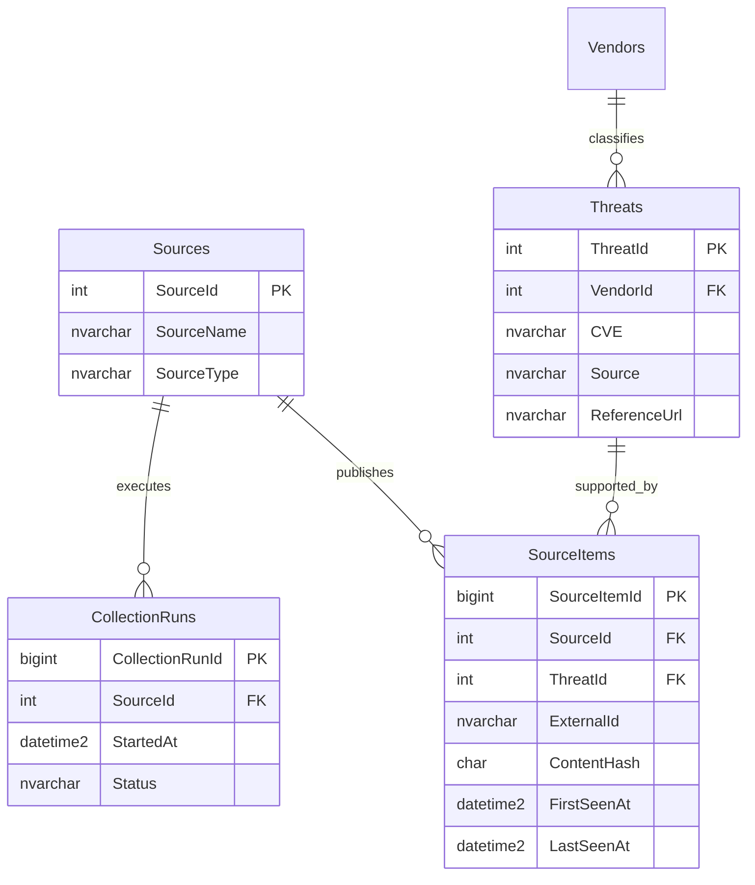

# Sprint 6 — Threat Intelligence Consolidation Design Review

Status: design proposal only  
Branch reviewed: `sprint-6-threat-consolidation`  
Baseline commit: `05099a2 Release CTI Dashboard v0.5.0-alpha`  
Scope: consolidate CISA KEV, NVD, Microsoft, Fortinet, Cisco, Veeam, and Broadcom VMware evidence into canonical `Threats` records without implementing collectors or changing the database in this review.

## Executive recommendation

Keep `Threats` as the canonical record and keep `SourceItems` as the source-evidence record. The current nullable `SourceItems.ThreatId` foreign key already permits many source observations, from many `Sources`, to point to one `Threat`. Adding a second junction table now would duplicate that relationship without solving a demonstrated Sprint 6 requirement.

Use an additive migration in the implementation sprint to close the actual gaps:

1. link each new `SourceItem` to the `CollectionRun` that observed it;
2. store an indexed normalized CVE, provider modified date, and normalized source metadata on each `SourceItem`;
3. assign a deterministic precedence priority to each `Source`;
4. record how a `SourceItem` was matched to a `Threat`; and
5. add a canonical provider-modified timestamp to `Threats`.

Do not merge records by title alone. Treat `ContentHash` as change/duplicate evidence, not as canonical identity. Preserve every existing CISA `ThreatId` and `SourceItemId`; consolidation should link new evidence to those records, not replace them.

A `ThreatSources` junction becomes justified only if one immutable source observation must link to multiple canonical Threats—for example, if a single vendor advisory covering several CVEs is stored once rather than normalized into one observation per CVE. Until that requirement is implemented, the direct foreign key is the smaller and safer design.

## Current-state assessment

### Current relationships



- `Sources -> CollectionRuns` is one-to-many. A run records source, timing, status, counters, worker, and a summarized error.
- `Sources -> SourceItems` is one-to-many. A source item stores provider identity, one URL, selected extracted fields, raw payload, content hash, processing state, and observation timestamps.
- `Threats -> SourceItems` is one-to-many through nullable `SourceItems.ThreatId`. Therefore one Threat can already be supported by SourceItems from CISA, NVD, and multiple vendors.
- `CollectionRuns` and `SourceItems` are not currently related. A run reports aggregate counts, but the individual observations created or confirmed by that run cannot be queried.
- `Threats.Source`, `Threats.ReferenceUrl`, and the other Threat fields are a single canonical/display snapshot. `_apply_threat_values()` currently replaces that snapshot with every changed or newly linked source item.

### Current collection and duplicate flow

For each normalized item, the service currently:

1. searches `SourceItems` by `(SourceId, ExternalId)`;
2. treats an unchanged content hash as skipped and updates `LastSeenAt`;
3. otherwise searches any SourceItem by the normalized `ContentHash`;
4. otherwise searches Threat by exact uppercase CVE, or by exact case-insensitive title when no CVE exists;
5. updates the matched Threat from the current item, or creates a Threat; and
6. commits each item independently while updating aggregate `CollectionRun` counters at the end.

This is adequate for one production source, but “last source processed wins” is unsafe once sources disagree.

### Capability assessment

| Capability | Current support | Assessment |
|---|---|---|
| One Threat linked to multiple sources | Yes | Multiple SourceItems with different SourceIds may share one ThreatId. The ORM lacks `Threat.source_items`, but the database relationship exists. |
| Multiple source URLs | Partial | Each SourceItem has one SourceUrl, so a Threat can have several URLs across SourceItems. The UI and Threat record expose only one selected ReferenceUrl, and an updated SourceItem overwrites its previous URL. |
| Source-specific metadata | Partial | RawContent preserves provider payload and SourceItem stores title, URL, and publication date. Normalized product, CVE, CVSS, severity, recommendation, due date, and provider-modified date are not retained as queryable source evidence. |
| Per-source first/last seen | Partial | FirstSeenAt and LastSeenAt exist per SourceItem. There is no direct per `(ThreatId, SourceId)` aggregate and no run-to-item history. Multiple observations from one source require aggregation. |
| Source confidence or priority | No | Sources has no precedence, confidence, trust, or field-authority configuration. Processing order currently determines the canonical value. |

## Schema limitations

1. `SourceItems` has no `CollectionRunId`, so observation-level run provenance is missing.
2. `SourceItems` does not store normalized CVE separately from RawContent. Cross-source CVE resolution depends on the canonical `Threats.CVE`, not evidence-level identity.
3. `Threats.CVE` stores only one CVE. A vendor advisory may cover several CVEs.
4. Exact CVE lookup is not protected by a unique constraint and uses `scalar()`, so pre-existing duplicate Threat CVEs make resolution ambiguous.
5. CVE-less exact-title matching is too aggressive. Common titles can merge unrelated vulnerabilities.
6. `ContentHash` mixes identity-like and mutable fields. It is useful for detecting unchanged content, but two source descriptions of the same vulnerability will normally have different hashes.
7. `Threats` has one Source, ReferenceUrl, Title, Summary, Severity, CVSS, and PublishedDate; field provenance and alternatives are not represented there.
8. `_apply_threat_values()` overwrites non-null canonical fields with null or lower-authority values and has no source-aware precedence.
9. No source provider modified date is stored, and `Threats` has no canonical modified date.
10. FirstSeenAt/LastSeenAt belong to the mutable current SourceItem row. Repeated runs do not create observation history and cannot be attributed to a run.
11. SourceItem RawContent is sufficient for forensic retention but is inefficient and fragile for routine matching or precedence queries.
12. Source-specific vendor aliases can create duplicate Vendors because `_get_or_create_vendor()` only performs case-insensitive name equality.
13. The web UI, search, and dashboard assume single-value canonical fields. They do not expose evidence or explain why a canonical value won.
14. Imported Threat deletion is blocked when SourceItems exist, which protects provenance but must remain compatible with any new relationship.

## Proposed minimal data model

### Keep unchanged

- Keep `Threats` as the canonical record used by the dashboard, Threat list, search, and CRUD.
- Keep `SourceItems.ThreatId` as the one-Threat/many-observations association for Sprint 6.
- Keep `(SourceId, ExternalId)` as the provider identity constraint.
- Keep RawContent as the complete source evidence.
- Keep all existing primary keys and foreign keys; do not renumber or recreate CISA rows.

### Minimum additive columns

| Table | Column | Suggested SQL Server type | Purpose |
|---|---|---|---|
| Sources | `Priority` | `SMALLINT NOT NULL DEFAULT 50` | Deterministic tie-breaker; check 0–100. Field-specific rules still take precedence over this global value. |
| SourceItems | `CollectionRunId` | `BIGINT NULL` initially | FK to CollectionRuns. Nullable permits a safe legacy backfill; require it for every new collected item after deployment. |
| SourceItems | `CVE` | `NVARCHAR(50) NULL` | Uppercase validated primary CVE for indexed evidence matching. |
| SourceItems | `SourceModifiedDate` | `DATETIME2 NULL` | Provider-reported last modification date, distinct from LastSeenAt. |
| SourceItems | `NormalizedMetadata` | `NVARCHAR(MAX) NULL` | Versioned JSON containing normalized source-specific values not promoted to Threat, such as product, advisory IDs, vectors, due date, aliases, and all reported URLs. |
| SourceItems | `MatchMethod` | `NVARCHAR(30) NULL` | Audit value such as `ExistingLink`, `CVE`, `AdvisoryId`, `CanonicalUrl`, `TitleCandidate`, or `Created`. |
| Threats | `ModifiedDate` | `DATETIME2 NULL` | Latest authoritative provider modification date selected by consolidation. It is not the application row-update time. |

Recommended indexes:

- `IX_SourceItems_CollectionRunId (CollectionRunId)`.
- filtered `IX_SourceItems_CVE (CVE) WHERE CVE IS NOT NULL`.
- `IX_SourceItems_ThreatId_SourceId (ThreatId, SourceId)` including FirstSeenAt and LastSeenAt.
- retain `UX_SourceItems_SourceId_ExternalId`.

Add the CollectionRun FK with `ON DELETE NO ACTION`. Add an `ISJSON(NormalizedMetadata) = 1` check when metadata is non-null if the deployed SQL Server compatibility level supports it.

Do not add a unique constraint to `Threats.CVE` until production data has been audited for duplicate and multi-CVE behavior. The resolver should detect multiple candidates and quarantine/report the ambiguity rather than select the first row.

### Why no new junction table yet

The direct relationship supports the stated requirement:

```text
Threat 42
  <- SourceItem 1001 / CISA
  <- SourceItem 2007 / NVD
  <- SourceItem 3012 / Microsoft
```

A `ThreatSources(ThreatId, SourceItemId)` table would reproduce those same links while requiring every existing query, delete guard, model relationship, and backfill to understand two paths.

Introduce the junction only when one SourceItem must support more than one Threat. That threshold is likely to appear with multi-CVE vendor advisories. Sprint 6 can remain minimal by normalizing such an advisory into one logical SourceItem per CVE, using a provider identity such as `issuer:advisory-id:CVE-id` while retaining the complete original payload. If preserving one immutable advisory row is later preferred, migrate to a many-to-many link and a normalized `ThreatCVEs` table together.

## Matching rules

Matching has two different purposes and must not mix them:

- **Observation identity** answers whether the same provider item was seen before.
- **Canonical identity** answers which Threat the observation supports.

### Observation identity

1. Exact `(SourceId, ExternalId)` is authoritative for a provider item. Changed content updates its evidence fields and LastSeenAt; unchanged content only confirms LastSeenAt.
2. ContentHash detects exact normalized-content repeats and changes. It must not be the primary canonical Threat key.
3. Canonicalized SourceUrl may assist provider deduplication when ExternalId is absent, but it must be namespaced by SourceId.

### Canonical Threat matching priority

| Priority | Key | Automatic action | Guardrails |
|---:|---|---|---|
| 1 | Validated CVE ID | Link to the single existing Threat with the same uppercase CVE. | If zero matches, continue/create. If more than one matches, record an ambiguity and do not auto-merge. Never merge observations carrying conflicting CVEs. |
| 2 | Vendor advisory ID | Link when normalized issuer/vendor plus advisory ID matches existing evidence. | Advisory IDs are namespaced by issuer, not globally. An ID quoted by NVD may match the issuer's advisory only after issuer normalization. |
| 3 | Canonical source URL | Link when normalized HTTPS host/path/identity query matches and issuer/vendor is compatible. | Lowercase host, remove fragments/default ports and known tracking parameters, preserve identity-bearing query values. Redirects and changed vendor URLs require alias handling. |
| 4 | Normalized title composite | Produce a candidate, not an unconditional merge. | Require no conflicting CVE, same normalized vendor/issuer, compatible product, and a bounded publication-date window. Low-confidence candidates require review or remain separate. |

Recommended confidence labels for diagnostics, even if Sprint 6 stores only MatchMethod:

- CVE exact: `Certain`.
- issuer + advisory ID exact: `High`.
- issuer-compatible canonical URL exact: `High`.
- normalized title/vendor/product/date composite: `Candidate`.
- title alone: `Rejected for automatic merge`.

Title normalization should Unicode-normalize, case-fold, collapse whitespace, normalize punctuation/dashes, and remove only an explicit allowlist of boilerplate prefixes. It must not remove version numbers, product names, CVEs, or semantic tokens.

## Field precedence matrix

General rules apply before field-specific precedence:

1. A missing value never overwrites a populated value.
2. A lower-priority or equally authoritative source does not cause canonical fields to oscillate merely because it ran later.
3. Manual Threats with no SourceItems are treated as protected manual records. Matching evidence may be linked, but automatic overwrite requires an explicit future manual-override policy.
4. Global `Sources.Priority` breaks otherwise equal ties; it does not replace field-specific authority.
5. Store every source value in SourceItem normalized metadata/raw evidence even when it loses canonical selection.

Suggested default source priorities are: issuing vendor advisory `100`, CISA KEV `90`, and NVD `70`. These values determine ties only. CISA remains uniquely authoritative for KEV membership and required-action/due-date data; NVD remains useful for standardized CVSS enrichment; issuing vendors remain authoritative for their own titles, products, remediation, and dates.

| Canonical field | Precedence rule | Conflict behavior |
|---|---|---|
| Severity | Derive from the selected CVSS vector/score when available. Otherwise use issuing-vendor qualitative severity, then NVD severity, then the existing CISA Critical fallback. | Do not select the most severe value simply because it is highest. Record alternatives. CISA KEV status means exploited, not inherently a CVSS severity, but existing CISA records retain Critical until stronger data is selected under an approved policy. |
| CVSS score | Prefer the newest supported CVSS specification; within the same version prefer an explicit issuing-vendor score/vector, then NVD. | Never take `MAX(CVSS)`. Store source, vector, and version in NormalizedMetadata so the choice is reproducible. |
| Vendor | Verified issuer/vendor mapping, then issuing-vendor identity, then CISA vendorProject, then NVD vendor data. | Do not create a new Vendor automatically when an alias maps ambiguously. Queue/report the mapping and keep the current canonical Vendor. |
| Title | Issuing-vendor advisory title, then CISA vulnerabilityName, then NVD description-derived title. | Replace only with a non-empty higher-authority value. Preserve the old/source titles in evidence. |
| Description / Summary | Issuing-vendor technical description, then NVD description, then CISA short description. | Do not choose by string length. Keep CISA ransomware/notes and vendor details in source metadata; canonical summary may be selected deterministically rather than concatenated without attribution. |
| Published date | Earliest credible original publication date from the issuer, then NVD when issuer date is unavailable. | CISA `dateAdded` is first inclusion in KEV, not original publication; preserve existing value for compatibility until a better date arrives, then select the earlier authoritative publication date. |
| Modified date | Maximum valid provider-reported modification date across linked evidence. | Do not substitute LastSeenAt or CollectionRun time. Reject future/outlier dates under validation policy and retain the prior canonical value. |
| KEV flag | Logical OR, with CISA KEV as the authoritative positive assertion. | Once true from CISA evidence, another source's false/absence cannot clear it. Clearing requires explicit CISA removal policy and audit; do not infer removal from a missing feed item. |

For the existing Recommendation field, use CISA required action/due date when KEV is true; otherwise prefer the issuing vendor's remediation. Preserve both source values in evidence.

`Threats.Source` and `Threats.ReferenceUrl` remain compatibility/display fields. Set them from the evidence that supplies the selected title or, if that is ambiguous, from the highest-priority linked source. All URLs remain available through SourceItems.

## Preservation and migration approach

### Preserve the 1,647 CISA KEV records

Read-only verification against the configured SQL Server on 2026-07-18 found:

- 1,647 Threats;
- 1,647 CISA SourceItems, all linked;
- 1,647 distinct linked ThreatIds;
- one CISA CollectionRun;
- zero case-insensitive duplicate non-null CVE groups; and
- zero Threats without SourceItems.

This is a clean one-CISA-observation-to-one-Threat baseline. The single run makes CollectionRunId backfill plausible, but timestamps and operational history must still be checked before asserting that every item originated in that run.

1. Take and restore-test a SQL Server backup before implementation.
2. Record baseline counts and checksums for Threats, CISA SourceItems, Vendors, and their foreign-key links.
3. Apply additive nullable columns only. Do not rename, drop, recreate, or reseed existing tables.
4. Preserve every existing `ThreatId`, `SourceItemId`, `SourceId`, CISA CVE, canonical field, CreatedAt, FirstSeenAt, LastSeenAt, and raw payload.
5. Set CISA Source Priority to the approved value without changing Threat rows.
6. Backfill `SourceItems.CVE` from ExternalId only when it passes the strict CVE validator; otherwise leave it null and report it.
7. Backfill NormalizedMetadata idempotently from RawContent in bounded batches. Keep RawContent unchanged.
8. Backfill CollectionRunId only when the originating run is provable. If the current deployment has one unambiguous CISA run, it may be linked after validation; otherwise leave legacy rows null and require the field for new observations. Do not invent provenance.
9. Initialize `Threats.ModifiedDate` as null. CISA does not provide a per-vulnerability modified timestamp in the current mapping.
10. Run the new resolver in dry-run/report mode against all CISA records. It should propose zero Threat replacements and zero ID changes.
11. Enable new sources in shadow mode: store/normalize evidence and report proposed links/field changes before allowing canonical updates.
12. Reconcile counts and hashes after every phase. Roll back the migration if identifiers, links, or CISA values change unexpectedly.

No existing CISA Threat should be deleted merely because another source has richer data. New evidence links to the existing CVE Threat and may update selected canonical fields only through the approved precedence rules.

### Deployment sequence for the eventual migration

Use an expand/backfill/enforce pattern:

1. **Expand:** add nullable columns, checks, FKs, and non-unique indexes with no behavior change.
2. **Dual write:** collectors populate old fields plus new evidence fields and CollectionRunId.
3. **Backfill:** process existing CISA rows in bounded, idempotent batches with reconciliation reports.
4. **Shadow resolve:** calculate matches and canonical values without changing Threats.
5. **Activate:** enable precedence-controlled canonical updates behind a configuration flag.
6. **Enforce:** after all writers are upgraded and legacy data is assessed, require CollectionRunId for new collector-created rows at the service layer. A database NOT NULL constraint is only safe if all legacy rows can be attributed.

## Backward-compatibility risks

| Risk | Impact | Mitigation |
|---|---|---|
| Existing duplicate Threat CVEs | `scalar()` resolution may select ambiguously or fail. | Preflight duplicate report; never auto-merge ambiguous rows; resolve under an approved data-cleanup plan. |
| Existing title-only matching | Unrelated CVE-less advisories may already be merged or may merge in future. | Stop automatic title-only merges; emit candidates and retain separate Threats. |
| Last-source-wins updates | NVD or a vendor feed can erase CISA/vendor values with null or lower-authority data. | Route all collected updates through one precedence resolver; no collector writes Threat fields directly. |
| Manual record overwrite | There is no explicit Origin or field-lock metadata. | Treat Threats without SourceItems as protected; defer automatic overwrite and document manual review. |
| UI assumes one source and URL | Users may interpret the canonical display field as the only evidence. | Keep fields for compatibility in Sprint 6; later add an evidence view without changing existing routes. |
| Dashboard Last Update uses CreatedAt | Canonical enrichment will not affect the displayed update time. | Decide separately whether dashboard semantics should use a future application UpdatedAt; do not silently change it during schema rollout. |
| Multi-CVE vendor advisories | `(SourceId, ExternalId)` permits one row per advisory, while one row can link to only one Threat. | In minimal phase emit one logical observation per CVE with composite external identity; adopt junction plus ThreatCVEs if one immutable advisory row is required. |
| Source URL changes | Updating the current SourceItem loses the prior URL. | Store all reported URLs in NormalizedMetadata or add URL history only when a proven requirement exists. |
| New FK to CollectionRuns | Legacy records may not have attributable runs. | Add nullable, backfill only proven links, enforce for new writes in service code. |
| Vendor aliases | New sources may create duplicate Vendor rows and split dashboard counts. | Add reviewed alias mapping before enabling each vendor collector; do not fuzzy-create ambiguous vendors. |
| Changed Source/ReferenceUrl selection | Search results and clickable links may change even though ThreatId is stable. | Shadow diff, deterministic priority, and acceptance tests for existing CISA display behavior. |
| Concurrent collectors | Two sources may resolve/create the same CVE concurrently. | Use transaction retry plus a database uniqueness strategy only after duplicate cleanup; until then serialize consolidation per identity or use an application lock. |
| Delete behavior | New provenance relationships can create new FK failures. | Retain NO ACTION FKs and update delete guards/tests with every relationship change. |

## Recommended Sprint 6 implementation sequence

### Phase 0 — Decisions and data audit

- Confirm that a canonical Threat is CVE-centric when a valid CVE exists.
- Decide the multi-CVE advisory strategy and approve source/field precedence.
- Inventory duplicate CVEs, duplicate titles, vendor aliases, null/malformed CISA identities, and actual run attribution.
- Capture database backup, baseline counts, and rollback criteria.

Deliverable: approved decision record and read-only audit report. No merging.

### Phase 1 — Additive provenance schema

- Introduce a versioned migration baseline.
- Add the minimal columns, checks, FKs, and indexes described above.
- Update SQLAlchemy mappings and relationships without changing routes or UI behavior.

Deliverable: expanded schema with old behavior unchanged.

### Phase 2 — Normalization contract v2

- Extend NormalizedItem with provider modified date, primary CVE, advisory identifiers, canonicalized URL, metadata version, and reported alternatives.
- Define URL/title/vendor normalization as pure tested functions.
- Require every new SourceItem to carry CollectionRunId and normalized evidence.

Deliverable: source-neutral evidence contract and unit tests.

### Phase 3 — Consolidation resolver

- Separate observation deduplication from Threat matching.
- Implement ordered match decisions, ambiguity handling, field precedence, and a deterministic resolution result.
- Make one service responsible for all collected Threat mutations.
- Add dry-run output showing candidate Threat, match method, winning fields, losing fields, and reasons.

Deliverable: resolver tests and no production canonical updates by default.

### Phase 4 — CISA backfill and regression

- Backfill new evidence columns without changing existing IDs or values.
- Run dry-run reconciliation across all 1,647 CISA records.
- Verify collector repeat behavior, dashboard counts, Threat CRUD, deletion guard, SourceItems, and CollectionRuns.

Exit criterion: 1,647 existing CISA Threats preserved, zero unexplained relinks, and repeat collection creates no duplicate Threats.

### Phase 5 — NVD shadow integration

- Add NVD as the first enrichment source because CVE provides a strong common key.
- Store NVD evidence and produce proposed canonical diffs without applying them.
- Review CVSS/version, description, vendor mapping, date, and duplicate outcomes.
- Activate canonical updates only after sampled and aggregate acceptance checks pass.

### Phase 6 — Vendor sources one at a time

- Implement Microsoft, Fortinet, Cisco, Veeam, and Broadcom VMware adapters separately.
- Establish issuer/advisory-ID patterns and vendor mappings per provider.
- Run each in shadow mode before activation; do not enable all vendor sources in one release.

### Phase 7 — Optional many-to-many evolution

- If real provider data proves that one immutable SourceItem must support multiple Threats, add `ThreatSources` and `ThreatCVEs` in a separate reviewed migration.
- Backfill links from SourceItems.ThreatId, switch reads/writes, verify, then consider deprecating—but not immediately dropping—the direct ThreatId column.

This phase is conditional and is not part of the minimum Sprint 6 schema.

## Exact files likely to change during implementation

No files below are changed by this design review. The likely implementation scope is:

### Existing files

- `database/init.sql` — keep fresh-install DDL aligned after a reviewed migration exists.
- `app/models/source.py` — Source Priority.
- `app/models/source_item.py` — run FK, CVE, modified date, normalized metadata, match method, relationships, and indexes.
- `app/models/threat.py` — canonical ModifiedDate and source-items relationship.
- `app/models/collection_run.py` — source-items relationship.
- `app/models/__init__.py` — exports only if new models are eventually introduced.
- `app/collectors/normalizer.py` — NormalizedItem v2 and normalization helpers.
- `app/collectors/deduplication.py` — split observation lookup from ordered canonical matching.
- `app/collectors/service.py` — persist run provenance and delegate canonical resolution/precedence.
- `app/collectors/cisa_kev.py` — populate the expanded source-neutral evidence contract without changing CISA semantics.
- `app/collectors/commands.py` — dry-run/backfill/reconciliation commands and future collector registration.
- `app/collectors/__init__.py` — future collector registration imports.
- `app/threats/routes.py` — only if evidence relationships or canonical update semantics affect CRUD/delete guards.
- `app/dashboard/routes.py` — only if Last Update semantics are explicitly changed.
- `app/templates/threats.html` and `app/templates/threat_form.html` — only for a later approved evidence display; not required for the minimal backend rollout.
- `docs/data-model.md`, `docs/collector-framework.md`, `docs/architecture.md`, and per-source collector documents — align implemented behavior with the approved design.

### Likely new files

- a versioned database migration and migration baseline/configuration;
- `app/services/threat_consolidation.py` — match decisions and field precedence;
- `app/services/vendor_mapping.py` — explicit provider alias resolution, if kept separate;
- `app/collectors/nvd.py`;
- later, one collector module each for Microsoft, Fortinet, Cisco, Veeam, and Broadcom VMware;
- unit tests for normalization, matching, precedence, ambiguity, and URL/title normalization;
- SQL Server integration tests for migration/backfill, concurrent resolution, FK behavior, and CISA preservation.

## Acceptance criteria for the implementation sprint

- One CVE Threat may be supported by CISA plus any number of new source items without duplicate Threat creation.
- Every new source item is attributable to a CollectionRun.
- Every canonical field choice is deterministic from retained evidence and documented precedence.
- Exact CVE conflicts and multiple matching Threats fail safely as ambiguity; they never silently merge.
- Title alone never causes an automatic cross-source merge.
- Missing/lower-authority values never erase stronger canonical data.
- All 1,647 existing CISA Threat IDs, source evidence, and KEV flags remain intact.
- Existing dashboard and Threat routes retain their current contracts unless a separately approved UI change is made.
- Migration rollback and reconciliation are tested on a production-like restore.

## Final design decision

Approve the direct `SourceItems.ThreatId` association as the Sprint 6 minimum. Add only the provenance and precedence data the current model lacks, then implement one deterministic consolidation service before adding NVD. Defer `ThreatSources`/`ThreatCVEs` until real multi-CVE advisory requirements demonstrate that one observation must relate to multiple canonical Threats.
